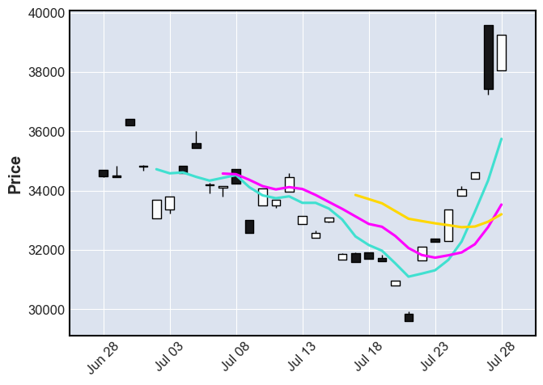
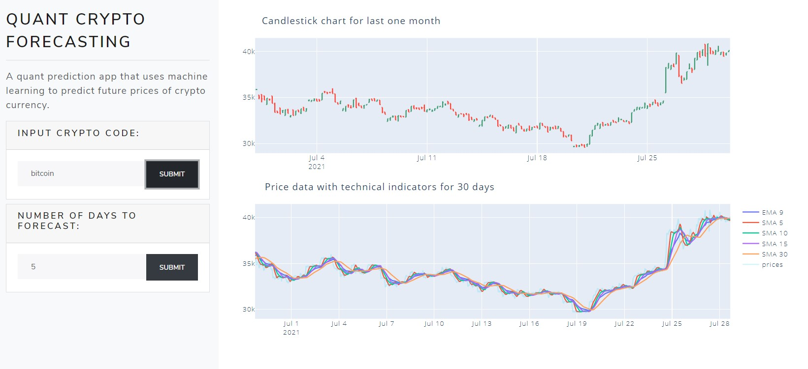
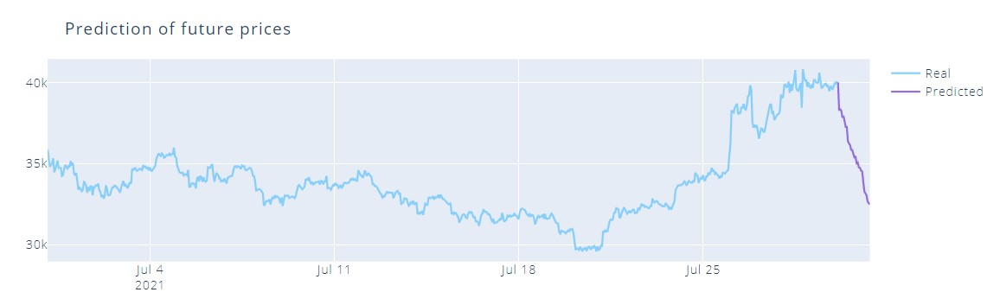

# quant-predictions-crypto

## Description of the project
A `dash` app to predict the price of crypto based on historical data. The app also features advanced chart analysis with more than 5 technical indicators for a crypto currency.

## How to Run - 
1. Install the dependencies with: 
```bash
# it's recommended to install your python packages in a virtualenv
# python 3
$python -m venv env && .env/bin/activate

# install the dependencies from requirements.txt
$pip install -r requirements.txt
```
2. Run the flask server at the root directory:
```bash
# run by executing app.py
$python app.py

# run by flask
$flask run
```

## Data description, API and Features
- Data is taked in JSON format from [coingecko API](https://www.coingecko.com/en/api#explore-api), [pycoingecko](https://github.com/man-c/pycoingecko) library is used as a wrapper to make the API requests with ease.
- We use Open, High, Low, Close data to plot our charts.
- We use Prices, Exponential Moving Averages, Simple Moving Averages, Relative Strength Index, and MACD for our prediction. All the mentioned features are extracted using sliding window technique from the prices.



We see that the moving averages play an important role in tracing the price of an asset.

## Web App - 


### Predictions from web app - 


##  Model Description
We have used XGBoost Regression model to predict our prices. The model is trained on live server with new data points whenever a user makes a request.
The model then predicts the data for the next day and the features are calculated based on the new predicted price and is added to the original data to predict the next point.

## Deployment
The model is deployed on [Heroku](https://www.heroku.com/) as a web-app. The charting feature is working on deployed, but the prediction is facing timeout issue due to the time taken by live training. 
You can view the model [here](https://quant-crypto-predictions.herokuapp.com/).

## Further Contributions
We are open to suggestions and ideas! Feel free to raise an issue.

## LICENSE
[MIT](./LICENSE)